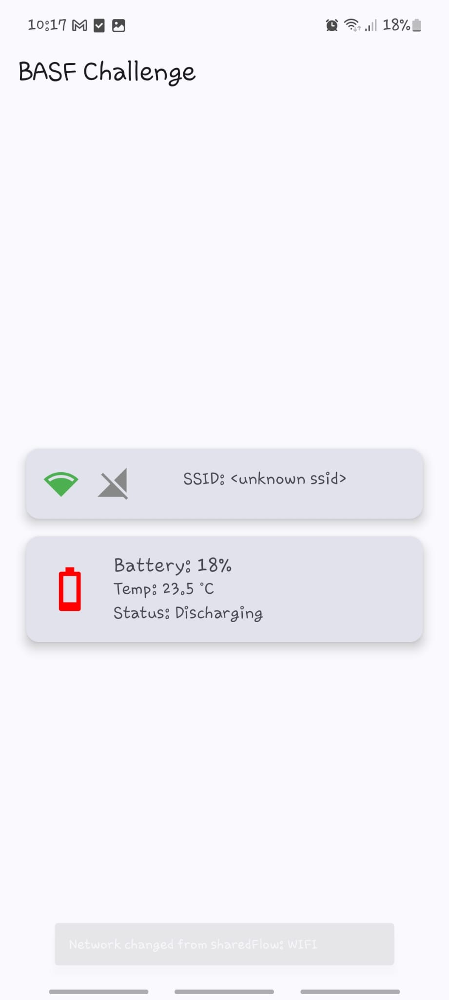

# 📱 BASF IMT - Android Code Challenge

Este proyecto es una solución al reto técnico de BASF Industrial Mobility Technology. La aplicación tiene como objetivo **monitorear el estado de la red y la batería** del dispositivo Android, notificando al usuario sobre cualquier cambio relevante.

---

## 🚀 Funcionalidades

### 🔌 Monitoreo del estado de red
- Detecta si el dispositivo tiene conexión a internet.
- Informa al usuario cuando pierde o recupera la conectividad.
- Muestra alertas visuales (UI alert) en cada cambio.

### 🔋 Monitoreo del estado de la batería
- Obtiene el nivel actual de batería en tiempo real.
- Notifica al usuario cuando la batería baja del 20%.
- Actualiza la interfaz cada vez que cambia el nivel de batería.

### 🖼 Interfaz de usuario
- Pantalla simple e intuitiva que muestra el estado actual de la red y la batería.
- Indicadores visuales actualizados en tiempo real.
- UI reactiva y eficiente, alineada con los eventos del sistema.

---

## 🛠 Tecnologías y arquitectura

- 🟣 **Lenguaje:** Kotlin
- 🏛 **Arquitectura:** MVVM + Clean Architecture
- ♻️ **Lifecycle-aware components** para evitar memory leaks
- 🔔 Notificaciones del sistema
- 📡 Broadcast Receivers y `StateFlow`/`SharedFlow` para eventos de red y batería
- 🧩 Inyección de dependencias con Hilt

---

## 📂 Estructura del proyecto

```bash
📦 app
 ┗ 📂 src
    ┗ 📂 main
       ┣ 📂 java
       ┃  ┗ 📂 com
       ┃     ┗ 📂 ck
       ┃        ┗ 📂 basfchallenge
       ┃           ┣ 📂 data
       ┃           ┃  ┣ 📂 local         # Acceso a servicios del sistema (batería/red)
       ┃           ┃  ┗ 📂 repository    # Implementaciones de repositorios
       ┃           ┣ 📂 di               # Módulo de inyección de dependencias (Hilt)
       ┃           ┣ 📂 domain
       ┃           ┃  ┣ 📂 models        # Modelos del dominio
       ┃           ┃  ┣ 📂 repository    # Interfaces de repositorio
       ┃           ┃  ┗ 📂 usecases      # Casos de uso
       ┃           ┣ 📂 presentation
       ┃           ┃  ┣ 📂 view          # UI (composables / pantalla principal)
       ┃           ┃  ┗ 📂 viewmodel     # ViewModel para red y batería
       ┃           ┗ 📂 ui
       ┃              ┗ 📜 MainActivity.kt
       ┗ 📂 res                        # Layouts, drawables, valores, etc.
```
---

## 📸 Captura de pantalla

<p align="center">
  
</p>
---

## ⚙️ Cómo ejecutar el proyecto

1. Clona el repositorio:

```bash
git clone https://github.com/tu_usuario/basf-imt-challenge.git
```

2. Ábrelo con Android Studio  
3. Conéctalo a un dispositivo físico o emulador (mínimo API 21)  
4. Compila y ejecuta

---

## 📄 Documentación adicional

- Código documentado con comentarios explicativos
- Separación clara de capas y responsabilidades
- Uso mínimo de librerías externas para mayor control y flexibilidad

---

## ⏱ Tiempo estimado

Este reto fue desarrollado en menos de 4 horas, como indicaba el enunciado oficial&#8203;:contentReference[oaicite:0]{index=0}.

---

## 📬 Entrega

Puedes enviar el código comprimido (`.zip`) o compartir el repositorio público directamente como se indica en las instrucciones del desafío&#8203;:contentReference[oaicite:1]{index=1}.

---

¡Gracias por la oportunidad y por revisar este proyecto! 🙌
